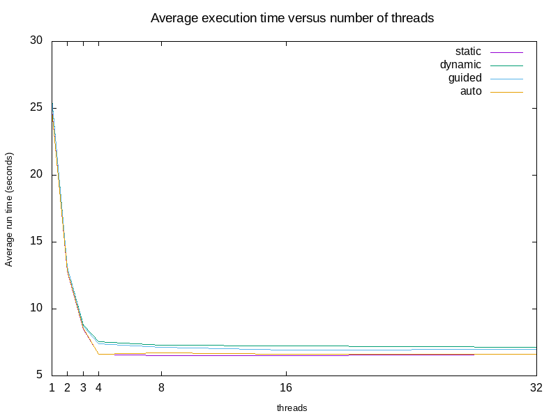

# openmp

The rule of thumb is:
---------------------

* real < user: The process is CPU bound and takes advantage of parallel execution on multiple cores/CPUs.
* real ≈ user: The process is CPU bound and takes no advantage of parallel exeuction.
* real > user: The process is I/O bound. Execution on multiple cores would be of little to no advantage.

https://software.intel.com/en-us/articles/openmp-loop-scheduling

```
#pragma omp parallel for schedule(kind [,chunk size])
```

Four different loop scheduling types (kinds) can be provided to OpenMP, as shown in the following table. The optional parameter (chunk), when specified, must be a positive integer.

| Kind	  | Description |
| ------- | ----------- |
|static	  | Divide the loop into equal-sized chunks or as equal as possible in the case where the number of loop iterations is not evenly divisible by the number of threads multiplied by the chunk size. By default, chunk size is loop_count/number_of_threads.Set chunk to 1 to interleave the iterations. |
| dynamic | Use the internal work queue to give a chunk-sized block of loop iterations to each thread. When a thread is finished, it retrieves the next block of loop iterations from the top of the work queue. By default, the chunk size is 1. Be careful when using this scheduling type because of the extra overhead involved. |
| guided  | Similar to dynamic scheduling, but the chunk size starts off large and decreases to better handle load imbalance between iterations. The optional chunk parameter specifies them minimum size chunk to use. By default the chunk size is approximately loop_count/number_of_threads. |
| auto	  | When schedule (auto) is specified, the decision regarding scheduling is delegated to the compiler. The programmer gives the compiler the freedom to choose any possible mapping of iterations to threads in the team. |
| runtime | Uses the OMP_schedule environment variable to specify which one of the three loop-scheduling types should be used. OMP_SCHEDULE is a string formatted exactly the same as would appear on the parallel construct. |

*Dicas:*

Como calcular a média e o desvio padrão com awk para um arquivo com valores separados por virgulas:

$ cat ARQUIVO.CSV | awk -F',' '{print $4}' | awk '{delta = $1 - avg; avg += delta / NR; mean2 += delta * ($1 - avg); t+=$1; i+=1} END { print sqrt(mean2 / NR),t/i; }'

Observações
-----------
* Aumentar o número de threads além do número de cores (oversubscription) não apresentou ganho significativo;
* Os diferentes tipos de paralelização se comportaram de forma semelhante pelo menos para o exemplo em questão;
* O tempo USER é praticamente constante já que denota o uso de CPU;



Bibliografia
------------

* OpenMP http://www.openmp.org/resources/
* Parallel Programming with OpenMP http://www.linux-magazine.com/Issues/2008/94/OpenMP
* OpenMP: What is the benefit of nesting parallelizations? https://stackoverflow.com/questions/4317551/openmp-what-is-the-benefit-of-nesting-parallelizations
* Oversubscription on Multicore Processors http://upc.lbl.gov/publications/ipdps-iancu.pdf
* OpenMP Environment Variables http://docs.cray.com/books/S-2179-52/html-S-2179-52/z1050587246oswald.html
* OpenMP Scheduling http://cs.umw.edu/~finlayson/class/fall14/cpsc425/notes/12-scheduling.html
* Clang Compiler User’s Manual https://clang.llvm.org/docs/UsersManual.html#controlling-errors-and-warnings

